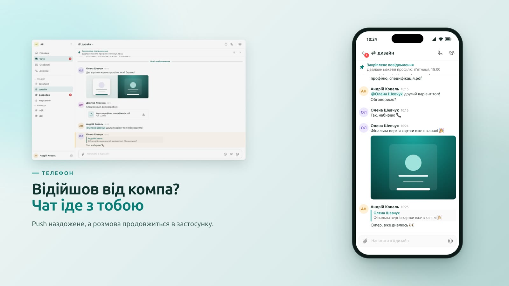

# AP Chats

Командний месенджер AP замість Discord: канали, особисті повідомлення, вкладення, дзвінки та push-сповіщення, з входом через спільний AP-акаунт.

[](docs/media/ap-chats.mp4)

## Структура

```text
src/       NestJS API (REST + Socket.IO)
web/       Chats як remote shell-а AP: React, Vite, Ant Design (порт 5557)
mobile/    Expo-оболонка над shell: вхід, push, нативні дзвінки
infra/     локальні сервіси та production-деплой
docs/      рішення й архітектура
```

Один pnpm workspace: корінь — API, `web` і `mobile` — окремі пакети зі спільним lockfile.

## Локальний запуск

Потрібні Node 24, pnpm 11 (через corepack) і Docker.

```bash
cp .env.example .env
cp web/.env.example web/.env
cp mobile/.env.example mobile/.env
corepack enable
pnpm config set //npm.pkg.github.com/:_authToken "$(gh auth token)"   # раз; токен з read:packages: gh auth refresh -s read:packages
pnpm install --frozen-lockfile
pnpm infra:up                            # Postgres, Valkey, LiveKit
pnpm dev                                 # міграції, потім API на :3211
pnpm dev:web                             # remote chats :5557, відкривати через host з ap-app (:5556)
pnpm --filter @ap-chats/mobile start
```

Вхід працює через OIDC-клієнти Chats, зареєстровані в AP Accounts (`backend-LMS`); issuer, audience і client ID задаються в `.env` файлах. Веб-вхід веде host з ap-app, тому redirect URI веб-клієнта `http://localhost:5556/auth/callback`, а його `VITE_OIDC_CLIENT_ID` лежить у `host/.env` репозиторію ap-app.

## Перевірки

```bash
pnpm quality   # lint, typecheck, build API
pnpm test      # API, web, mobile
```

## Далі

- Деплой: [infra/README.md](infra/README.md)
- Push-сповіщення: [docs/push-notifications.md](docs/push-notifications.md)
- Вкладення: [docs/chat-uploads.md](docs/chat-uploads.md)

## Мікрофронтенди

Shell володіє документом, входом, темою, роутером і спільним sider; Chats та інші застосунки є Module Federation remote-ами. Shell (host) і пакети `@ap-education/shell-sdk`, `@ap-education/ui`, `@ap-education/federation` живуть в окремому репозиторії `ap-app`, там же архітектура, контракт і ADR. `web/` бере їх з GitHub Packages (`npm.pkg.github.com`), тому `pnpm install` потребує токена з `read:packages` у конфігурації користувача; у GitHub Actions це `secrets.GITHUB_TOKEN` з `permissions: packages: read`.
