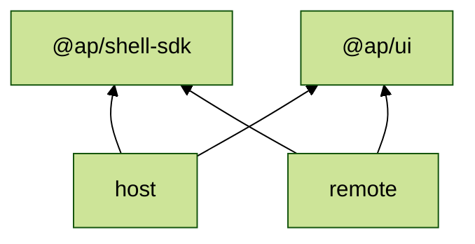

# 0002. Межі пакетів shell-а

## Рішення

Пакет виділяємо за тим, хто його імпортує і які залежності він тягне:

- `@ap/shell-sdk` описує контракт між shell-ом і застосунками й залежить лише від react;
- `@ap/ui` є дизайн-системою і нічого не знає про shell. Сюди ж ідуть жести, які shell і застосунки мають узгоджувати між собою (`useTouchGesture`, `useSwipeDrawer`);
- `host/` і є shell: chrome (`features/layout`), runtime застосунків (`features/apps`), OIDC, перелік застосунків, env. Він залежить лише від пакетів і без змін переноситься в окремий репозиторій;
- remote залежить лише від `@ap/shell-sdk` і `@ap/ui`.

## Чому це важливо

- Межі тримає pnpm: імпортувати можна лише те, що є в `package.json`, тож remote фізично не дістане chrome.
- Контракт не тягне UI-залежностей і версіонується окремо від chrome, бо host і remote-и деплояться незалежно.
- Варіант з одним пакетом і subpath-ами (`@ap/shell/sdk`) відхилено: тоді antd і router стали б обов'язковими для кожного remote-а.
- Окремий пакет для chrome (`@ap/shell`) відхилено: його єдиний споживач host, деплояться вони разом, тож пакет лише дублював залежності й налаштування.

## Важливо

- Пакети не читають env і не звертаються до API. Значення вони отримують від застосунку.
- `@ap/ui` не має власних React-контекстів, тому його копії в різних remote-ах не конфліктують. Якщо контекст з'явиться, пакет треба додати в singletons.
- Контракт змінюється зворотно сумісно: нові поля необов'язкові.
