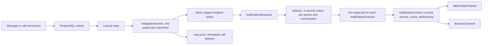

# Push notifications

## Delivery and ownership

Messages remain canonical Markdown in `chat_messages`. The message-content parser derives plain text through the `messagePlainText` function at the notification boundary; push does not import `MessagesModule` or normalize the stored Markdown again. Queue jobs carry event references, recipient identity and target identity; they do not snapshot message bodies. `MessageNotificationContentService` reads the current surviving unread messages immediately before sending, so a queued notification does not reuse a deleted or edited preview.

The flow is:

`EventPublisher` keeps its process-local realtime contract. `EventOutbox` records source message and call events in their owning Drizzle transaction, whether or not push is enabled: it is the durable path between modules, and push is one subscriber. The outbox repository owns append, leasing, acknowledgement and retention. `OutboxDispatcher` hands committed events to `IntegrationEvents`, which copies each one into the queue of every subscriber (`<event>@<subscriber>`), so a second consumer never competes with push for the same job. An event nobody subscribes to is acknowledged and dropped. The relay starts after application bootstrap, once every subscriber has registered; `BullMqJobQueue` owns only queue connections, scheduling, retries and shared rate limits. Business workers import repository and provider contracts, not BullMQ, provider SDKs or Drizzle.

The relay claims up to 100 eligible rows with `SKIP LOCKED` and a 60-second lease. It prioritizes call intents. Failed enqueue releases unsubmitted leases for the next relay tick; the 60-second lease is only crash recovery. PostgreSQL retains each source event until BullMQ accepts it, then deletes the row. A failed handoff is retried with the same per-subscriber job ID. A full batch is followed by the next one immediately instead of the one-second idle pause. After handoff, fanout and per-device jobs live in Valkey and use BullMQ retries; they are not additional PostgreSQL outbox records. Recovery of an accepted job therefore depends on Valkey persistence. Exhausted BullMQ jobs stay in the failed set for operator inspection and retry rather than receiving an unbounded automatic replay loop.

Notification audience is a read-only indexed projection over existing membership, cursor, settings, entries and mentions. This intentionally batches cross-module reads without making notifications the owner of those records. Only repositories in their owning modules write them. `NotificationPolicyService` remains the authority for mute, notification levels and own-message suppression. The default level alerts on all messages in channels and DMs; an explicit mentions level limits alerts to structured mentions.

## Component boundaries

| Owner                       | Responsibility                                                                                     |
| --------------------------- | -------------------------------------------------------------------------------------------------- |
| `devices`                   | Installation registration, current account owner and credentials                                   |
| `devices/targets`           | Native/browser device lookups and validation of the credential version held by a queued job        |
| `notifications/preferences` | Authenticated preference changes; channel access remains with channel-access                       |
| `notifications/policy`      | Shared mute, notification level and own-message rules for realtime and push                        |
| `notifications/realtime`    | Source-event conversion and unread socket delivery                                                 |
| `notifications/alerts`      | Chat side: paged recipient discovery and policy, and `NotificationContent` answered from chat data |
| `notifications/delivery`    | Delivery side: collecting bursts, channels and transports                                          |
| `delivery/channels`         | `NotificationChannel` strategies; each owns its targets, transport and permanent rejections        |

`NotificationsModule` composes preferences, realtime, alerts and delivery. Alerts hand chosen recipients to `NotificationRequests`; delivery asks the chat side only through the `NotificationContent` port, whose single `render` answers with the newest unread message or nothing, bound in `NotificationDeliveryModule.register`. `notifications/delivery` and `devices` import no chat modules or chat tables, so they can move to a separate notification service with the port becoming a call back to this API; that package boundary is what will enforce it. A new channel (a messenger bot, a device on a desk) is one `NotificationChannel` class added to `NotificationChannelsModule`; the alert flow does not change. Message delivery and incoming-call delivery have separate contracts because their payloads, deadlines and native obligations differ. `voip-push` still reads call state directly and is the next step before extraction.

Browser push lives in `features/notifications`. `api/` wraps the server endpoints and the browser subscription; `usePush` synchronizes the subscription per account through react-query and `usePushToggle` enables or disables it. `PushSubscriptionSync` is a null-rendering component that re-registers on visibility, reconnect and a five-minute timer, re-subscribes when permission is granted but the subscription is gone or was made with a rotated VAPID key, and respects a local "turned off" choice. Sign-out deletes the server registration but keeps the browser subscription, so the next sign-in binds it to the new account. `PushNavigation` is the single handler for notification taps from the service worker and from the native shell. The browser service worker uses native Push and Notifications APIs.

## Interruption policy

`ConversationAlertScheduler` reads bounded keyset pages of 100 recipients, applies recipient policy and hands the eligible people to `NotificationRequests`; the next page is scheduled only after the current one is enqueued.

The model is Telegram's: every new message may notify, and the operating system keeps one notification per conversation. Defaults are product choices, not a provider protocol:

- Collect for 3 seconds from the first eligible message, per person and conversation. Later messages in that time join the same alert, and a message read in that time is never announced.
- Each alert shows the newest unread message at send time (for the mentions level, the newest unread mention), not the message that triggered it.
- The Expo collapse ID, the iOS thread ID, the Android and browser tag and the Web Push topic are the conversation, so a new alert replaces that conversation's previous one instead of stacking up.
- There is no server-side cooldown or per-person budget; noisy conversations are handled by muting or the mentions level, as in Telegram.

Changing mute or membership before send suppresses delivery, and read, deleted and own messages are never shown.

Provider traffic is a separate limit. The Expo queue is globally limited to 500 message jobs per second, below Expo's documented 600 notifications per project per second; Web Push has a separate limit. These limits are shared by BullMQ workers across API replicas. Each message delivery job sends one notification, so job and notification counts match. Per-device jobs allow independent retry and token invalidation. This uses individual valid SDK requests rather than pretending the free BullMQ edition provides batch workers. If higher request efficiency is required, add a bounded batching adapter while preserving the shared notification-count quota. Other senders using the same Expo project must share its rate budget. See [Expo delivery constraints](https://docs.expo.dev/push-notifications/sending-notifications/) and [BullMQ shared rate limiting](https://docs.bullmq.io/guide/rate-limiting).

Web Push topics and Expo collapse IDs replace superseded pending notifications; OS tags/thread IDs group visible alerts. Web topic replacement is defined by [RFC 8030, section 5.4](https://datatracker.ietf.org/doc/html/rfc8030#section-5.4).

Calls use separate immediate queues, a high-priority outbox intent and a 45-second deadline. They bypass message coalescing. Delivery verifies current ringing state and access before contacting APNs/FCM.

Delivery is **at least once**. A crash after a provider accepted a notification and before the queue recorded completion can cause a duplicate. Stable native call event IDs and channel notification tags reduce duplicates; this is not a guarantee of exactly-once OS delivery. Expo send tickets that report an unregistered device remove its token; a token that Expo only rejects later is replaced when the app re-registers on its next foreground. Invalid tokens and expired subscriptions are removed only if the attempted token/subscription still matches, so a delayed rejection cannot erase a rotated token or a new account owner.

`devices` owns native and browser installations and their current account. Native Expo and VoIP tokens remain explicit fields. A one-to-one `web_push_subscriptions` child holds endpoint and encryption keys, with a cascading device FK; it has no duplicated account owner. This split accommodates a browser's different credential shape without a generic polymorphic endpoint/EAV model. `DevicesService` handles registration commands. `PushTargetsService` composes native and browser target discovery; each target strategy verifies ownership and credential version and conditionally invalidates rejected credentials; `notifications` owns interruption decisions and transport dispatch.

One installation or browser endpoint has one current owner. Account takeover updates ownership; old-account DELETE requests are scoped to that old owner. Delivery rechecks ownership and target identity. An incoming notification tap also carries the intended account, workspace and channel.

## Configuration

1. Use PostgreSQL 16 and Valkey from `infra/docker-compose.yml`. Valkey has a persistent volume, AOF and `noeviction`, as required for durable queues. Migration `0018_push_delivery` adds the outbox and device-owned browser subscriptions. Existing duplicate native installations retain their newest owner. Set `VALKEY_URL` (`redis://` or `rediss://`) for the deployment. AOF every second has a durability window. Unacknowledged source events can be replayed from PostgreSQL; acknowledged source events and their accepted child jobs depend on Valkey persistence. See [BullMQ production configuration](https://docs.bullmq.io/guide/going-to-production) and [Valkey persistence](https://valkey.io/topics/persistence/).
2. Set `PUSH_ENABLED=true` after migration, provider credentials and client builds are ready. Every instance records outbox events regardless of this flag; it only decides whether push subscribes to them. Redis availability does not participate in the message transaction; outbox insertion does.
3. Keep `PUSH_WORKER_ENABLED=true` on at least one running API instance: it runs the outbox relay and all queue workers, so without one the outbox only grows. Set it to false on HTTP-only instances. `PUSH_WORKER_CONCURRENCY` controls per-instance transport workers, default 8. Start modestly and adjust using queue lag and provider rate-limit errors.
4. Generate a persistent VAPID pair with `pnpm exec web-push generate-vapid-keys --json`. Set `WEB_PUSH_PUBLIC_KEY`, `WEB_PUSH_PRIVATE_KEY` and `WEB_PUSH_SUBJECT` together. Subject is an HTTPS or `mailto:` contact. Keep the private key server-side. After rotating VAPID keys, disable and re-enable push in each browser to create a new subscription.
5. Configure Expo EAS push credentials for `com.apeducation.native`: an Apple APNs key and Android FCM v1 credentials. The EAS project ID is already in `mobile/app.json`. Set server `EXPO_ACCESS_TOKEN` if enhanced Expo push security is enabled. EAS access credentials and the application's Accounts user token are separate credentials.
6. Supply `mobile/google-services.json` for the matching Firebase Android application before generating/building Android. It is referenced by app config and must come from the project's Firebase setup. The server's `FCM_PROJECT_ID` and `FCM_SERVICE_ACCOUNT_JSON` are additionally needed for direct Android call pushes.
7. iOS call pushes use all four `APNS_*` server values, with the VoIP topic for the native bundle. `mobile/app.config.ts` is the single source for the build's APNs environment and its entitlement. Local builds default to sandbox; EAS profiles explicitly set `EXPO_PUBLIC_APNS_ENVIRONMENT=production`. Match the actual signed provisioning profile. The registered device environment selects the sandbox or production APNs host.

`PUSH_ENABLED=false` disables ordinary and call push delivery and hides browser enablement; outbox events are still relayed and, with no push subscriber, dropped. There is one durable push path. Socket unread delivery remains independent of push configuration.

## Clients

Web Push requires HTTPS (localhost is a development exception), a supporting browser and permission granted by an explicit button click. The navigation sidebar exposes enable/disable. A service worker displays the notification. It takes control immediately (`skipWaiting`, `clients.claim`), and on click focuses an open window and posts the target to it for in-app navigation, or opens a new window. It also handles `pushsubscriptionchange` by telling open pages to register again. The manifest supports installation; on iOS/iPadOS, install the app on the Home Screen before enabling Web Push. No private API response or access token is cached by the worker.

Only the tab the person is attending to (visible and focused) holds presence: it sets a 75-second lease on gaining attention and renews it every 30 seconds. Losing attention clears it after a short grace, unless another tab claimed attention over `BroadcastChannel` meanwhile, so tabs never overwrite each other. The presence request carries only `focused`. While that lease is live its subscription does not receive a second OS alert; the existing realtime path handles local sound. Closing the page clears the lease with a keepalive request on pagehide; pageshow restores presence after back/forward cache navigation. When a browser with push enabled is hidden, the local realtime sound is suppressed. Replacing a channel's OS notification requests a new alert with renotify. Cursor advancement remains the read-state feature's responsibility. Presence is an interruption hint and never grants access.

Expo creates the Android message channel before asking for permission. Ordinary Expo and native VoIP tokens register independently, including when ordinary notifications are denied. Registration is serialized with logout, retries transient failures, runs again on foreground and responds to native token rotation. An active connected WebView handles foreground alerts; otherwise Expo displays the notification.

Notification taps from an already-running or cold-started app wait for authentication and a ready WebView listener. The bridge validates the internal conversation route and intended account, selects the workspace, then acknowledges the intent. An old acknowledgement cannot erase a newer tap. CallKit cold starts hydrate `getActiveCallSession()` before answering and wait for restored/refreshed auth. Foreground and socket reconnect synchronize call state against the API. A device that stays suspended may still ring until the native timeout because the CallKit library has no supported remote-cancellation push payload.

CallKit owns the native audio session; LiveKit globals disable automatic audio configuration. Incoming answers connect the room, fulfill the native answer action, then wait for audio activation before enabling the microphone. Waiting for audio before fulfilling the answer deadlocks on iOS. An answer replay joins once; hangup cancels pending media work. The WebView reuses an existing incoming session. Remote end/answer-elsewhere signals report the native ending and release local media without sending another decline or leave to the server.

Use custom native development/release builds for remote push and CallKit; Expo Go is not the validation target.

## Operations and validation

BullMQ retains completed jobs for up to seven days and failed jobs for up to fourteen days, with a 10,000-job cap per queue. Outbox cleanup removes expired records in bounded batches. Monitor unacknowledged non-expired outbox age, queue waiting/delayed/failed counts, provider errors and device rejection counts. Alert on missing workers and calls approaching their deadline. Failed jobs can be retried by authorized operators; expired jobs complete without contacting a provider. Queue data contains source events or recipient/target references and expiry timestamps, without message bodies or device credentials. PostgreSQL payloads and device credentials still require normal database access controls.

Tests use isolated embedded PostgreSQL. The BullMQ integration test starts an isolated `valkey-server` process, verifies deduplication/retry and shared limits across two workers, and never connects to the application instance. Install the Valkey binary in the API test environment.

The implementation tests migration deduplication, transactional enqueue rollback, queue retry/claim behavior, ownership transfer, token rotation, current read/mute/access checks, deleted/edited previews, permanent versus transient provider failures, notification URLs and cold-start native state. Those isolated tests do not contact real devices or providers. Local verification uses the repository-compatible Node 24.21.0 runtime and an isolated Valkey process.

Before rollout, test with signed iOS and Android builds and HTTPS browser deployment:

- Unmuted DM and default channel messages arrive while the browser/app is closed; own messages and muted conversations stay silent. An explicit mentions level alerts only on structured mentions.
- Tapping opens the correct workspace/chat from foreground, background and cold start.
- Local iOS sandbox and distribution production call pushes both reach CallKit; stale/ended calls do not produce late rings after a queued retry.
- Accept from the lock screen with the app terminated and with it backgrounded: one native session connects with two-way audio. Hang up during connection and answer on another device: no phantom call or duplicate decline remains.
- Android ordinary messages reach Expo and call data reaches Telecom after native regeneration. The callkit config plugin removes the competing `ExpoFirebaseMessagingService` manifest entry and delegates non-call messages to Expo.
- Logout and account switching stop old-account delivery; rejected old tokens do not remove a newly registered token.
- A stopped worker resumes queued delivery after restart; provider transient failures retry and permanent failures clean up the matching target.

Push workers can scale across API instances. The existing Socket.IO transport is still process-local; distributing realtime broadcasts across replicas requires its own shared transport adapter. Push queue durability does not make socket events durable.

Provider references: [Expo setup](https://docs.expo.dev/push-notifications/push-notifications-setup/), [Expo receipts and delivery](https://docs.expo.dev/push-notifications/sending-notifications/), [WebKit Web Push requirements](https://webkit.org/blog/13878/web-push-for-web-apps-on-ios-and-ipados/), [BullMQ](https://docs.bullmq.io/), [web-push](https://github.com/web-push-libs/web-push).
